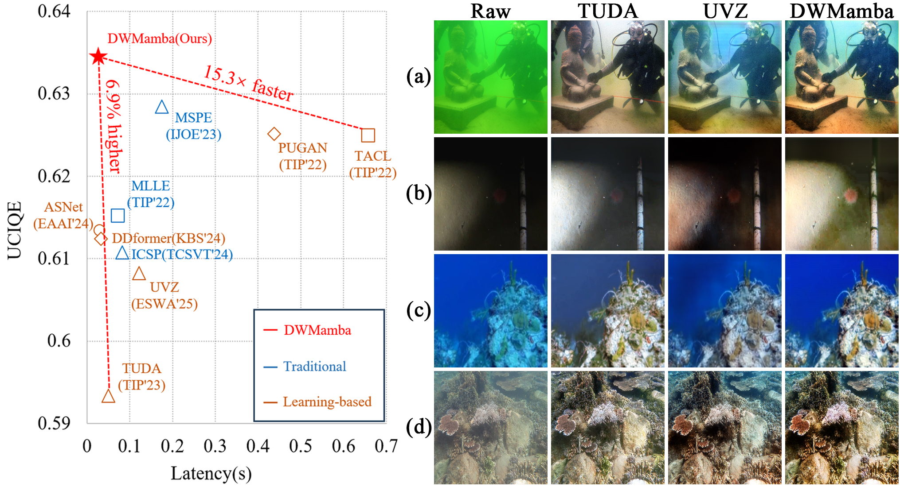
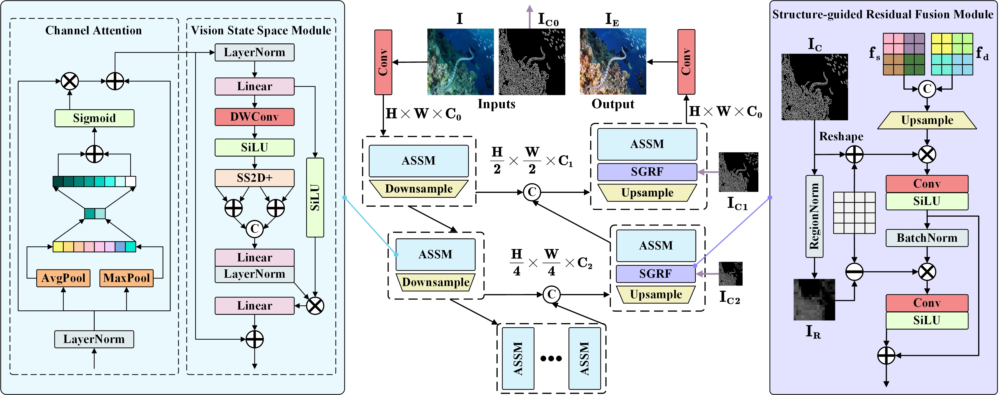
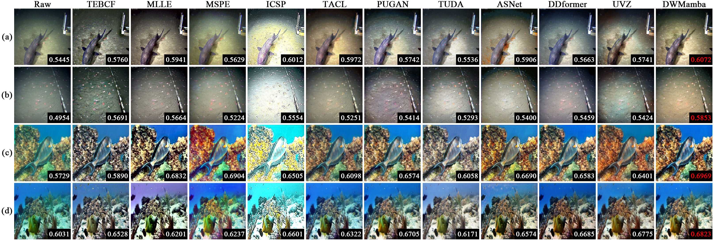

# DWMamba
This is the project of paper "DWMamba: A Fast, Robust, and Adaptive Mamba Network for Underwater Image Enhancement".

# Code
As with our previous works([UVZ](https://github.com/WindySprint/UVZ), [CTM](https://github.com/WindySprint/CTM)), the complete code will be released after this paper is received.

# Abstract 
Overcoming visual degradation in extreme environments is essential for improving underwater scene comprehension. While deep learning methods have integrated various perceptual capabilities and made significant progress, the high computational costs hinder their practical application in resource-limited underwater conditions. Additionally, when faced with diverse underwater degradations, existing methods lack effective modeling mechanisms to address the inconsistent attenuation across different color channels and space regions. To address these issues, we propose a lightweight and multi-scenario adapted network, DWMamba. Specifically, DWMamba introduces an innovative Adaptive State Space Module (ASSM) that uses a channel monitoring mechanism and a soft fusion strategy to capture global dependencies. By maintaining linear complexity, ASSM enhances the model's potential for handling non-uniform underwater degradation. Furthermore, leveraging explicit edge priors and region partitioning as cues, we design a Structure-guided Residual Fusion module (SGRF) to fuse shallow and deep features in a targeted manner, effectively enhancing degraded details and low-light textures. Extensive experiments demonstrate the impressive qualitative enhancement and quantitative performance of the proposed model. For example, DWMamba exceeds PUGAN in enhancement performance while reducing FLOPs by 93%, and exhibits excellent generalization in various extreme lighting conditions. Our code and model are available at https://github.com/WindySprint/DWMamba.

# Performance

# Network

# Visual Compare

# Contact
If you have any questions, please contact: Zhixiong Huang(hzxcyanwind@mail.dlut.edu.cn)
